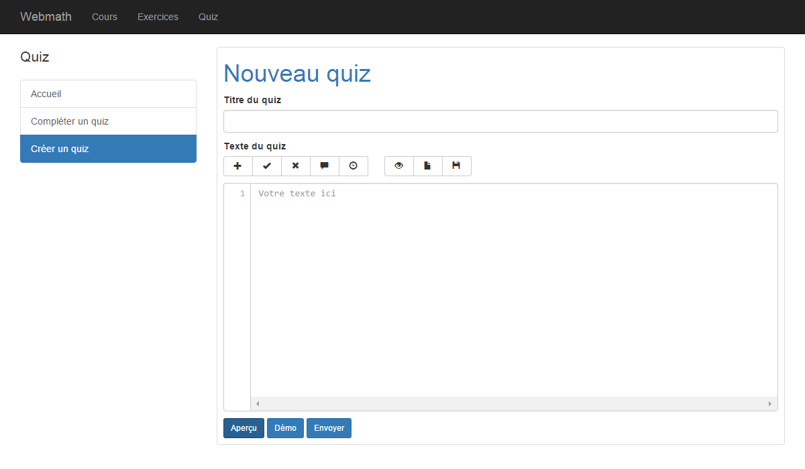
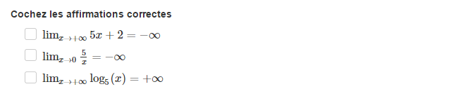
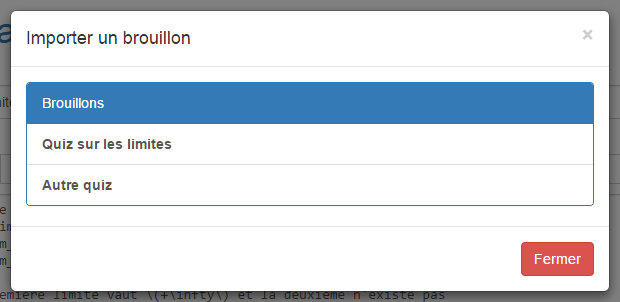
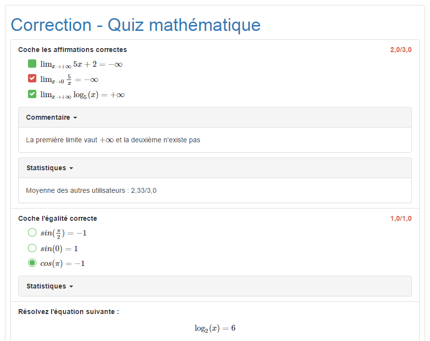
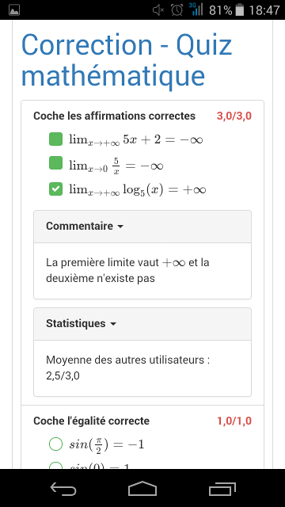

#########################
Documentation utilisateur
#########################

***********
Professeurs
***********

================
Création de quiz
================

.. _create_main

    
----------------------------------------------------
Création d'une question et définition de ses caractéristiques
----------------------------------------------------

La création du quiz se fait par l'intermédiaire d'un langage de balisage de type Markdown pour définir les différentes questions du quiz ainsi que leurs caractéristiques. Le code du quiz doit être écrit dans la zone de texte principale **(4)** La définition des questions se fait selon le schéma suivant : la première ligne du paragraphe sert à indiquer le type de question et l'énoncé, alors que les lignes suivantes décrivent les solutions ou options possibles ainsi que d'autres paramètres, comme le nombre de points attribués pour la question. Un double retour à la ligne marque le passage à la question suivante. 

Au début de chaque ligne, une balise suivie d'un espace indique la fonction de la ligne en question.

^^^^^^^^^^^^^^^^^^^^^^^
Explication des balises
^^^^^^^^^^^^^^^^^^^^^^^

+--------+-----------------------------------------------------------------------------+
| Balise | Signification                                                               |
+========+=============================================================================+
| ##     | Question à choix multiple avec plusieurs options qui peuvent être choisies  |
+--------+-----------------------------------------------------------------------------+
| \*\*   | Question à choix multiple avec une seule option qui peut être choisie       |
+--------+-----------------------------------------------------------------------------+
| ??     | Question avec un champ de texte à remplir                                   |
+--------+-----------------------------------------------------------------------------+
| \*     | Option invalide dans un QCM                                                 |
+--------+-----------------------------------------------------------------------------+
| =      | Option valide dans un QCM                                                   |
+--------+-----------------------------------------------------------------------------+
| =      | Réponse correcte dans une question à champ de texte                         |
+--------+-----------------------------------------------------------------------------+
| .      | Permet de définir le nombre de points sur la question (par défaut, 1)       |
+--------+-----------------------------------------------------------------------------+
| \+     | Ajout d'un commentaire d'explication qui sera affiché lors de la correction |
+--------+-----------------------------------------------------------------------------+

^^^^^^^^^^^^^^^^^^^^^^^^^^^^^^^^^^^^^^^^^^^
Exemple de quiz avec le système de balisage
^^^^^^^^^^^^^^^^^^^^^^^^^^^^^^^^^^^^^^^^^^^

.. code-block:: text
    
    ## Énoncé de la question à choix multiple (plusieurs cases peuvent être cochées)
    * Option 1
    = Option 2 (correcte)
    = Option 4 (correcte)
    + Commentaire affiché à la correction
    . 1.5
    
    ** Énoncé de la question à choix multiple (une seule case peut être cochée)
    * Option 1
    * Option 2
    = Option 3 (correcte)
    . 2
    
    ?? Question à réponse courte
    = Réponse correcte
    = Autre réponse correcte possible
    
Pour la première question, la balise ``##`` indique qu'il s'agit d'une question à choix multiple avec plusieurs réponses possibles, alors qu'une option incorrecte et deux options correctes sont respectivement définies avec les balises ``*`` et ``=``. Ensuite, on a ajouté un commentaire avec ``+`` et défini le nombre de points avec le symbole ``.``. Il est important de retenir que toutes les balises sont suivies d'un espace, sans quoi elles ne sont pas reconnues.

La barre d'outils **(2)** située en dessus de la zone de texte offre la possibilité de créer un quiz sans maîtriser le système de balisage. Pour ajouter une question, il suffit de cliquer sur l'onglet *Question* et de choisir le type de question souhaité dans le menu déroulant. La balise est insérée automatiquement et il n'y a plus qu'à écrire l'énoncé de la question. Il en va de même pour ajouter des solutions ou des options avec les boutons *Correct* et *Incorrect*. Les retours à la ligne et les espaces sont placés automatiquement avant et après la balise si cela est nécessaire. Le menu *Autres* permet de choisir le nombre de points à attribuer pour chaque question et d'écrire un commentaire destiné à être affiché lors de la correction automatique du quiz. Ce commentaire est censé apporter une justification à la solution de la question ou une aide pour les élèves n'ayant pas répondu correctement.

^^^^^^^^^^^^^^^^^^
Types de questions
^^^^^^^^^^^^^^^^^^

"""""""""""""""""""""""""
Question à réponse courte
"""""""""""""""""""""""""

La question à réponse courte se présente sous la forme d'un simple champ de texte à compléter. La balise caractérisant ce type de questions est la balise ``??``. Ensuite, une ou plusieurs réponses peuvent être définies comme correctes à l'aide de la balise ``=``. S'il y a plusieurs solutions, elles doivent être séparées par un retour à la ligne et chacune doit être précédée de la balise ``=``. Si la réponse donnée par l'élève correspond exactement à une des solutions, il obtient tous les points. Il est conseillé de ne pas définir des solutions complexes ou trop longues pour éviter de compter comme une erreur l'absence de virgule, de point ou d'un autre caractère spécial. Les réponses apportées par les élèves définies comme incorrectes lors de la correction automatique pourront toutefois être admise en tant que solution plus tard.

.. figure:: figures/short.png
    :align: center

""""""""""""""""""""""""""""""""""""""""""""""""""""
Question à choix multiples avec un seul choix valide
""""""""""""""""""""""""""""""""""""""""""""""""""""

Pour ce type, plusieurs options sont affichées et l'élève ne peut en sélectionner qu'une. La balise associé à ce type est la balise ``**``. Une seule option valide doit donc être définie avec la balise ``=``, toutes les autres doivent être erronées et donc précédées par la balise ``*``. L'élève reçoit tous les points s'il sélectionne la bonne solution, et aucun point dans tous les autres cas.

.. figure:: figures/radio.png
    :align: center

""""""""""""""""""""""""""""""""""""""""""""""""""""
Question à choix multiples avec un seul choix valide
""""""""""""""""""""""""""""""""""""""""""""""""""""

Définie par la balise ``##``, il s'agit d'une question semblable à la précédente mais l'élève a cette fois la possibilité de choisir plusieurs options. Les options qui doivent être sélectionnées sont définies avec la balise ``=`` et les autres avec la balise ``*``. Le professeur doit cependant définir au moins une option correcte. Lors de la correction, l'élève peut obtenir des points pour un choix qu'il a coché et que le professeur a défini comme correct et inversement, c'est à dire qu'il peut aussi gagner des points sur un choix qui n'est pas sélectionné, à condition qu'il soit défini comme erroné.

------------------------------------
Affichage de l'aperçu et des erreurs
------------------------------------

Il est possible à tout moment d'afficher un rendu du quiz tel que le verront les étudiants en cliquant sur le bouton *Aperçu* **(5)** en dessous de la zone de texte. On peut ainsi voir si toutes les questions s'affichent comme prévu **(8)** et également détecter les éventuelles erreurs dans le code. Ces erreurs apparaissent dans l'encadré rouge **(7)** en dessous du bouton *Aperçu*. Pour chaque erreur, un message explicatif apparaît accompagné du numéro de ligne où s'est produite l'erreur.

Voici un exemple de code comportant une erreur :

.. code-block:: text
    ## Cochez les options correctes
    = Option correcte
    * Option incorrecte
    =* Erreur dans la balise
    
Ici, on a tenté d'utiliser la balise ``*=``, qui n'existe pas. C'est pourquoi on obtient le message suivant : *Balise inconnue*.

Un quiz ne peut pas être envoyé et enregistré dans la base de données tant qu'il comporte encore des erreurs.

--------------------------
Affichage de mathématiques
--------------------------

Il est possible d'afficher des formules mathématiques à l'aide de la bibliothèque Javascript MathJax [#1]_. Cet outil permet d'écrire des expressions sous forme de LaTex et de les convertir en HTML pour qu'elles soient visibles dans le navigateur. Il existe deux méthodes d'affichage proposées par MathJax : la méthode *in-line* et la méthode *displayed*. La première méthode offre la possibilité d'inclure une formule dans un paragraphe de texte. Les formules en *in-line* doivent être entourées des caractères suivants : ``\(...\)``. Avec la méthode *displayed*, les expressions sont affichées en plus grand, centrées et détachées du reste du texte. Les formules utilisant cette méthode sont délimitées par les balises ``$$...$$``.

.. figure:: figures/math-menu.png
    :align: center

La barre d'outils propose un menu dédié à l'affichage des mathématiques **(2)**. Deux boutons permettent d'insérer les délimiteurs des méthodes *in-line* et *displayed* et d'autres options pour afficher un échantillon de formules et de symboles sont disponibles. Cette liste est toutefois non-exhaustive.

Voici un exemple de question comportant l'affichage de limites :

.. code-block:: text

    ## Coche les affirmations correctes
    * \(\lim_{x\to +\infty} 5x + 2 = -\infty\)
    * \(\lim_{x\to 0} \frac{5}{x} = -\infty\)
    = \(\lim_{x\to +\infty} \log_{5}(x) = +\infty\)
    
Résultat lors de l'aperçu :

-------------------------------------------
Enregistrement et importation de brouillons
-------------------------------------------

Les brouillons permettent de stocker dans la base de données le code d'un quiz qui n'a pas encore été envoyé et de le récupérer plus tard pour terminer l'édition du quiz et le publier.

Le menu *Brouillons* de la barre d'outils **(3)** est dédié à cette fonctionnalité.

.. figure:: figures/draft-save.png
    :align: center

Lorsqu'on clique sur le bouton *Enregistrer un brouillon*, une boîte de dialogue apparaît. Il suffit de préciser un titre pour le brouillon et d'appuyer sur *Enregistrer*. Un message confirmant que le brouillon a bien été enregistré apparaît.

Il est désormais possible d'importer ce brouillon grâce au bouton prévu à cet effet dans le menu. Une boîte de dialogue contenant la liste de tous les brouillons de l'utilisateur s'ouvre. Le brouillon recherché peut être importé par un simple clic. Le code du brouillon est alors inséré dans la zone de texte.

-----------------------
Envoi définitif du quiz
-----------------------

Lorsque l'édition du quiz est terminée et que toutes les questions sont prêtes, le quiz peut être envoyé afin d'être sauvegardé dans la base de données et disponible à la résolution pour les élèves. Avant d'envoyer un quiz, il faut s'assurer d'avoir défini un titre **(1)** et d'avoir corrigé toutes les éventuelles erreurs présentes dans le code **(7)**. Lors du clic sur le bouton *Enregistrer* **(6)**, un avertissement apparaîtra au cas où des erreurs persistent et l'envoi ne pourra pas se faire.

================
Suivi des élèves
================

--------------------------------------
Liste des quiz créés par un professeur
--------------------------------------

.. figure:: figures/my-quiz.png
    :align: center

Dans l'onglet *Mes quiz*, le professeur peut consulter la liste des quiz qu'il a créé avec des informations générales sur ceux-ci comme la moyenne de points obtenus pour chaque quiz. Grâce au bouton *Voir les stats*, il peut accéder aux statistiques avancées d'un quiz en particulier.

-----------------------------------
Affichage des statistiques avancées
-----------------------------------

.. figure:: figures/stats.png
    :align: center

Cette vue offre au professeur la possibilité de se faire une idée générale du niveau de compréhension des élèves d'un simple coup d'oeil. Pour chaque élève ayant répondu au quiz, il peut voir la note globale obtenue ainsi que les points attribués pour chaque question. Pour consulter les réponses soumises par un étudiant, le professeur peut cliquer sur le bouton orange situé au début de la colonne. Il sera ainsi redirigé vers la page de correction de la résolution.

Les boutons bleus *Afficher* permettent de faire apparaître un aperçu rapide de chaque question. Toutes les questions du quiz peuvent aussi être consultées en même temps grâce au bouton *Afficher toutes les questions*. 

Lorsqu'on affiche une question à réponse courte, il est possible de voir les réponses soumises par les élèves qui n'ont pas répondu correctement. Le bouton rouge situé avant chaque réponse permet de valider une réponse et de l'ajouter aux solutions valides.

.. figure:: figures/add-solution.png
    :align: center

Ici, on voit que des étudiants ont trouvé la solution de l'équation mais l'ont simplement exprimé sous une autre forme que celle qui était attendue. Pour obtenir les points, ils auraient dû n'écrire que "64". Après avoir cliqué sur le bouton, un message confirmant l'ajout de la solution apparaît, puis la couleur du bouton change. Les statistiques dans le tableau se mettent ensuite à jour. Désormais, tout élève écrivant la réponse sous cette forme-là obtiendra également les points pour la question.

*********
Étudiants
*********

===============
Trouver un quiz
===============

.. figure:: figures/find.png
    :align: center

Pour trouver un quiz, un étudiant a plusieurs possibilités. Le professeur peut donner l'URL exacte du quiz à compléter, ce qui peut être pratique dans le cas d'un courriel ou toute autre communication informatisée. Un étudiant peut aussi accéder à un quiz en mémorisant son id et en l'entrant dans la champ prévu à cet effet dans l'onglet *Compléter un quiz*.

===========================================
Compléter un quiz et correction automatique
===========================================

.. figure:: figures/complete.png
    :align: center

Une fois que l'étudiant a accédé au quiz, il peut le compléter très simplement en remplissant les champs de formulaires affichés. Lorsqu'il a fini, il peut soumettre ses réponses à l'aide du bouton prévu à cet effet. Les réponses soumises sont enregistrées dans la base de données et il est immédiatement redirigé vers une page de correction.

Les réponses incorrectes sont affichées en rouge avec la solution et une éventuelle explication donnée par le professeur pour chaque question. Les points reçus pour chaque question sont affichés avec le total de points sur le quiz. L'étudiant peut aussi comparer son score à la moyenne des autres étudiants qui ont complété le quiz.

La page pour compléter un quiz ainsi que celle de la correction sont optimisées pour la navigation sur mobile et le design responsive s'adapte parfaitement à tous types de périphériques tels que les téléphones portables ou les tablettes, comme le montre la capture d'écran ci-dessous.

==========================
Historique des résolutions
==========================

.. figure:: figures/completed.png
    :align: center

Les étudiants ont aussi la possibilité de garder une trace de tous les quiz qu'ils ont complétés. Dans l'onglet *Mes résolutions* sont présentées toutes les résolutions apportées par l'élève à un quiz. Diverses informations complémentaires sont également disponibles, telles que la date et l'heure de la résolution ou le nombre de points obtenus. En cliquant sur un élément de la liste, l'étudiant est redirigé vers la page de correction de la résolution et peut ainsi voir les éventuelles erreurs qu'il a commises.

.. [#1] http://www.mathjax.org/. Consulté le 29 mars 2015.